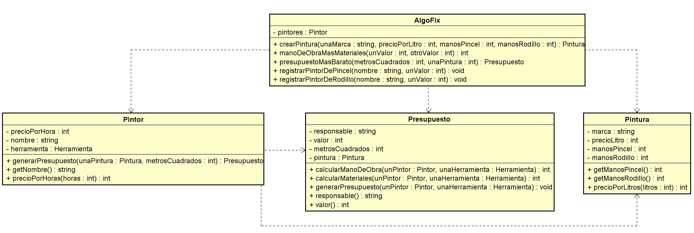
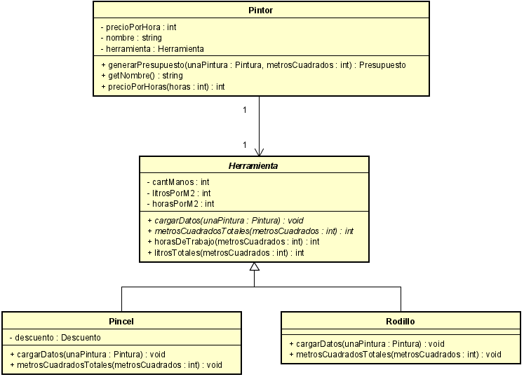
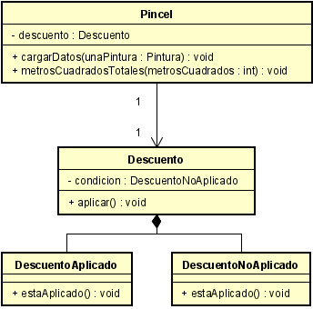

# Ejercicio — Smalltalk

## Índice

- 1. Introducción
- 2. Supuestos
- 3. Diagramas de clase
- 4. Detalles de implementación
- 5. Excepciones
- 6. Diagramas de secuencia

## 1. Introducción

El presente informe reune la documentación de la solución del ejercicio que consiste en desarrollar 
una aplicación de un sistema web de presupuestos para pintores en Pharo utilizando los conceptos del 
paradigma de la orientación a objetos vistos hasta ahora en el curso.

## 2. Supuestos

- Al registrar al mismo pintor con una herramienta diferente este se lo considera como otra
instancia de mismo, es decir habrá un pintor ’diego’ con pincel y otro pintor ’diego’ con rodillo.
- Al obtener 2 presupuestos minimos de igual valor se devolverá el primero detectado.

## 3. Diagramas de clase

  
Figura 1: Diagrama de interaccion entre AlgoFix y Pintor, Pintura y Presupuesto.

  
Figura 2: Diagrama de interaccion entre el pintor y sus herramientas.

  
Figura 3: Diagrama de interracion entre el pincel y la clase descuento.

## 4. Detalles de implementación

Una de las clases que me resulto personalmente de las más interesantes fue "Descuento", de-
mostrare su funcionamiento utilizando fragmentos de código siempre que sea posible para facilitar
su entendimiento.
Al momento de aplicar el descuento en caso de que los metros cuadrados pedidos sean mayores a
40, este se debe realizar solo en el cálculo de la mano de obra, donde solo los pintores de pincel
gozaran de este beneficio. Entonces ya que si multiplico cualquier elemento de la ecuación de mano
de obra por 0.5 el descuento se realizaría correctamente ya que el orden de los productos no altera
el resultado, por ende, la herramienta pincel sería la encargada de administrar este descuento.
Simplemente recibiendo como parámetro en cierto método la cantidad de metros cuadrados para
calcular los totales de estos, ya que se multiplican por la cantidad de manos necesarias según la
pintura recibida en el presupuesto.
La implementación es la siguiente, en la cual voy a alojar un fragmento de código para su mayor
entendimiento.

metrosCuadradosTotales: metrosCuadrados
| multiplicador |
(metrosCuadrados < 1) ifTrue: [ MetrosCuadradosEsMenorAUnoError signal ].
multiplicador := 1.
(metrosCuadrados > 40) ifTrue: [multiplicador := descuento aplicar].
^cantManos * metrosCuadrados * multiplicador.

Al crear una herramienta pincel esta tiene una variable de instancia llamada "descuento", a su
vez al instanciar un nuevo descuento a este se asigna como estado inicial ’DescuentoNoAplicado’,
la cual es una clase de la que depende ’Descuento’. Cuando presupuesto en el cálculo de la mano de
obra le delega a la herramienta Pincel calcular los metros cuadrados totales a cubrir, la herramienta
en el método adjunto arriba, verifica con un condicional ’if’ si los metros cuadrados son mayores
a 40 y si lo es, el objeto Descuento con método ’aplicar’ modifica el multiplicador, (a su vez, el
estado del descuento pasa de ’DescuentoNoAplicado’ a ’DescuentoAplicado’, la cual es otra clase
más de la que depende ’descuento’ y las cuales son encargadas de verificar si el descuento esta ya
aplicado o no), entonces el retorno del método por un factor de 0.5. De esa manera al seguir con
la ecuación el precio de ’Mano De Obra’ se reduce a la mitad.

## 5. Excepciones

PresupuestoSinPintoresError Fue creada con el propósito de evitar intentar generar un presu-
puesto en el programa sin tener ningún pintor registrado en el sistema. Se utiliza y comprueba
al momento de pedir el presupuesto mínimo, donde si la colección en donde se guardan estos
pintores esta vacía se lanza la excepción.

PintorSinPinturaError Fue creada con el propósito de evitar intentar generar un presupuesto
en el programa sin tener ninguna pintura instanciada. Se utiliza y comprueba al momento
de recibirla por parte del pintor, si esta referencia es nula se lanza la excepción.

CantidadDeManosMenorAUnoEnHerramientaErro rFue creada con el propósito de evitar
cargar una herramienta con parámetros inválidos, es decir a pincel y/o rodillo con cantidad
de manos igual o inferior a cero. Se utiliza y comprueba al momento de enviarle la pintura
a un método para cargar los datos a la herramienta.

MetrosCuadradosEsMenorAUnoError Fue creada con el propósito de evitar cargar un pre-
supuesto con parámetros inválidos. Se utiliza y comprueba a la hora de multiplicar las manos
de una herramienta por los metros cuadrados recibidos, si estos son menores a 1 se lanza la
excepción.

PintorRecibeValorPorHoraInvalidoError Se creo con el propósito de evitar calcular el precio
por X horas teniendo el valor hora del pintor menor a 1. Esto mismo se comprueba a la hora
de llamar al método precioPorHoras del pintor donde, se multiplica su arancel por una
determinada cantidad de horas requeridas para el presupuesto asignado.

PinturaRecibeValorPorLitroInvalidoError Se creo con el propósito de evitar calcular el pre-
cio por X litros teniendo el valor por litro de la pintura menor a 1. Esto mismo se comprueba
a la hora de llamar al método precioPorLitros de la pintura, donde se multiplica el precio
por litro de la misma por una determinada cantidad de litros a utilizar para el presupuesto
asignado.

## 6. Diagramas de secuencia

  
Figura 4: Diagrama de secuencia del calculo del costo de los materiales.

  
Figura 5: Diagrama de secuencia del calculo de la mano de obra en caso de metros cuadrados
mayores a 40 y herramienta pincel, se aplica descuento.
